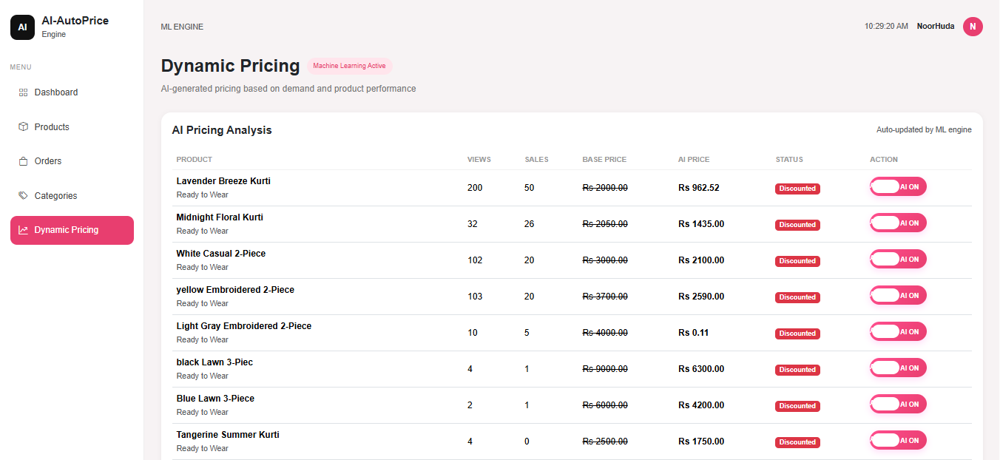
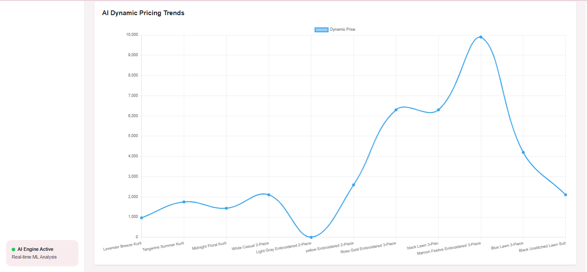
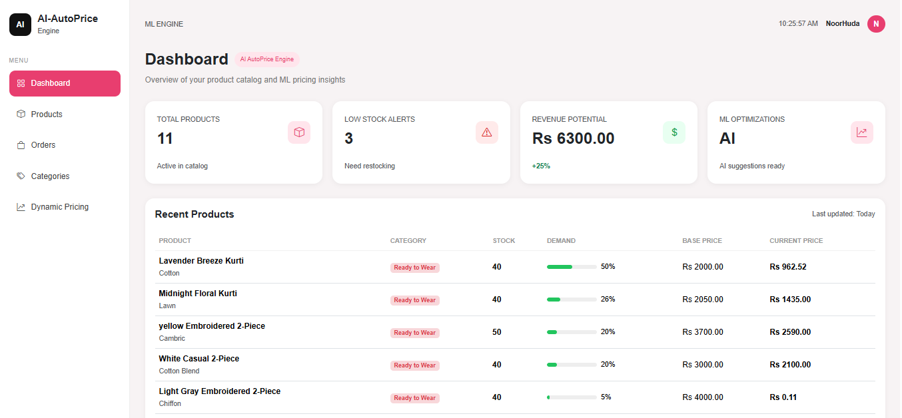
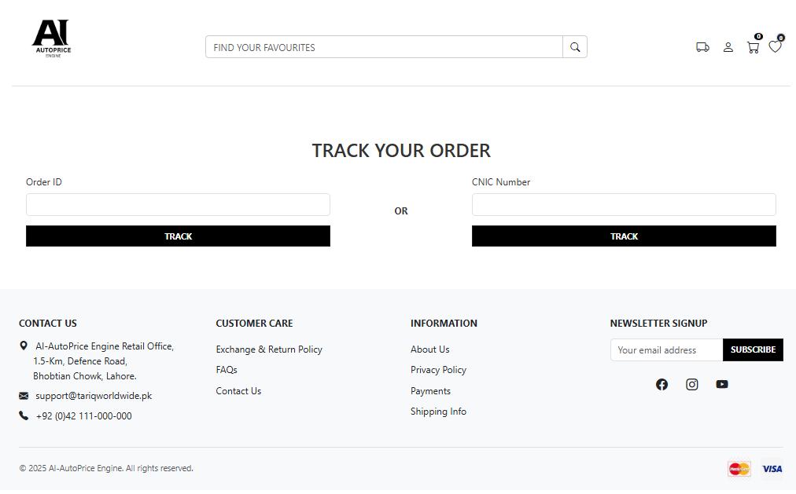

# 🤖 AI AutoPrice Engine 

An intelligent AI-powered pricing system for fashion e-commerce platforms that predicts optimal product prices using Machine Learning.

Built mainly for women’s clothing stores, the system helps businesses automate pricing decisions and maximize revenue through smart AI-driven insights.

---

# ✨ Features

- 🤖 AI-based dynamic pricing system
- 📊 Machine Learning price prediction
- 👗 Fashion product pricing engine
- ⚡ Real-time price suggestions
- 🛍️ Product management system
- 📈 Revenue optimization insights
- 🔐 Secure Django backend
- 🎨 Responsive frontend UI

---

# 🖼️ Project Screenshots

## 🏠 Home Page


## 🛍️ Shop Page


## 📂 Category Page


## 📦 Product Detail Page


## 🤖 Dynamic Pricing System


## 📈 AI Price Analytics Chart


## 📊 Admin Dashboard


## 🚚 Order Tracking Page


---

# 🚀 Tech Stack

- 🐍 Python
- 🌐 Django
- 🤖 Scikit-learn
- 📊 Pandas & NumPy
- 💾 SQLite
- 🎨 HTML, CSS, JavaScript

---

# 📁 Project Structure

```bash
ai-autoprice-engine/
│
├── dresses/
│   ├── migrations/
│   ├── static/
│   ├── templates/
│   ├── templatetags/
│   ├── admin.py
│   ├── forms.py
│   ├── models.py
│   ├── views.py
│   ├── urls.py
│   ├── price_predictor.py
│   └── model.pkl
│
├── media/
├── staticfiles/
├── tariqworldwide/
├── manage.py
├── requirements.txt
├── db.sqlite3
└── README.md
```
---

# 🧠 How It Works

## 1️⃣ Product Data Input

User submits product details such as:

- Category
- Brand
- Material
- Product Type

---

## 2️⃣ AI Processing

The Machine Learning model analyzes:

- Product attributes
- Market pricing patterns
- Existing pricing data

---

## 3️⃣ Smart Price Prediction

AI generates:

- Suggested selling price
- Optimized market value
- Revenue-friendly pricing

---

# ⚙️ Installation

## Clone Repository

```bash
git clone https://github.com/Noor-Huda-dev/ai-autoprice-engine.git
```

## Move Into Project Folder

```bash
cd ai-autoprice-engine
```

## Create Virtual Environment

```bash
python -m venv .venv
```

## Activate Environment (Windows)

```bash
.venv\Scripts\activate
```

## Install Dependencies

```bash
pip install -r requirements.txt
```

## Run Server

```bash
python manage.py runserver
```

---

# 👨‍💻 Developer

## Noor Huda

Django Developer • React.js Developer • AI/ML Enthusiast
